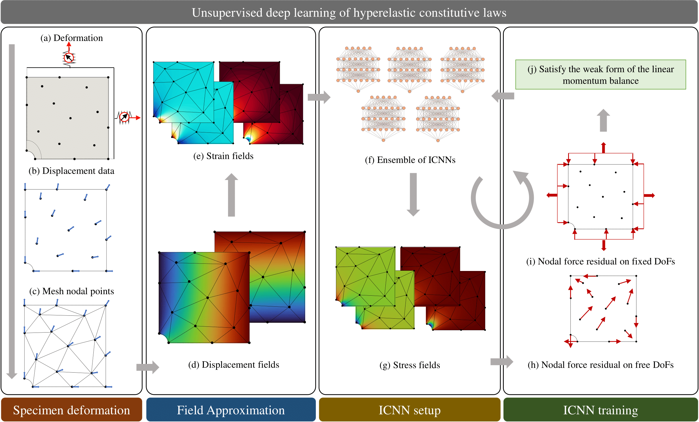

# NN-EUCLID: Deep-learning hyperelasticity without stress data
**EUCLID** stands for *Efficient Unsupervised Constitutive Law Identification and Discovery*. Visit the [project website](https://euclid-code.github.io/) to learn more and refer to the [online documentation](https://euclid-code.github.io/EUCLID-hyperelasticity-NN/mkdocs/site/) for more explanation on the individual software components. Within the scope of this project we developed NN-EUCLID:

- Thakolkaran, P., Joshi, A., Zheng, Y., Flaschel, M., De Lorenzis, L., & Kumar, S. (2022, September). **NN-EUCLID: Deep-learning hyperelasticity without stress data**. *Journal of the Mechanics and Physics of Solids*, 105076. https://doi.org/10.1016/j.jmps.2022.105076

NN-EUCLID is a deep-learning based framework to learn hidden material models using full-field displacement and global reaction force measurements. Below we give an overview of the framework: (a,b) Point-wise displacements and reaction forces are recorded for a hyperelastic specimen under quasi-static deformation. Using the point-wise displacements and a finite element mesh of the domain (c), continuous displacement and strain fields are obtained (d,e). An ensemble of physics-consistent ICNN-based constitutive models (f) map the strain fields to stress fields (evaluated at the quadrature point of each element) (g). The stress fields are used to compute the internal and external nodal forces (h,i). Based on the weak form of the conservation of linear momentum, the residual forces are minimized (j) — point-wise for the free degrees of freedom (h) and aggregated for the fixed degrees of freedom (under each set of Dirichlet constraint with a measured reaction force) (i). The optimization is carried out iteratively to train the parameters of the ICNN-based constitutive models (f).

## Installation

To get started, simply clone the repository using:

`git clone git@github.com:EUCLID-code/EUCLID-hyperelasticity-NN.git`

We recommend using an [Anaconda](https://www.anaconda.com/download) python environment. The project requires Python=>3.7 and the following third-party libraries:

- numpy
- scipy
- torch
- pandas
- matplotlib

## Dataset
We supply emulated (via FEM) digital image correlation experiment data in `fem-data/`. The dataset consists of the same experiment with nine different hyperelastic solids:

- Neo-Hookean
- Haines-Wilson
- Isihara
- Gent-Thomas
- Arruda-Boyce
- Ogden
- Anisotropic solid with one fiber family aligned at 45°
- Anisotropic solid with one fiber family aligned at 60°
- Holzapfel with two fiber families at +-30°

For each experiment we add two different magnitudes of gaussian noise to the displacements, denoted as *low* noise and *high* noise, respectively.

## Software components

For an in-depth explanation of essential functions and parameters please refer to the [online documentation](https://euclid-code.github.io/EUCLID-hyperelasticity-NN/mkdocs/site/).

- **main.py**         - main script for training ICNN-based material model. Requires the following arguments: `<fem_material>` and `<noise_level>`
- **config.py**       - Contains all configurations and parameters (e.g., NN hyperparameters, plotting options)
- **models.py**       - Contains the ICNN-based material model, and a custom linear layer class.
- **train.py**        - Training script containing the physics-guided loss formulation.
- **post_process.py** - Script to evaluate a trained ICNN model against the ground truth model on six deformation paths.

### Example of how to run

Given you want to learn the Isihara material model given displacement and global reaction force data with *high* noise conditioning on the displacement data:

- Go to drivers folder: `cd drivers/`
- Run the main file: `python main.py Isihara high`

## Authors:
This software is written by Siddhant Kumar, and Prakash Thakolkaran.
It is based on the work published [in the Journal of Mechancis and Physics of Solids](https://www.sciencedirect.com/science/article/pii/S0022509622002538) by

 * [Prakash Thakolkaran](https://www.mech-mat.com/people#h.sqzfck889r1k),
 * [Akshay Joshi](https://www.mech-mat.com/people#h.sqzfck889r1),
 * [Yiwen Zheng](https://sites.google.com/site/aniruddhvashisth123/people?authuser=0#h.g0otpf1xivt2),
 * [Moritz Flaschel](https://compmech.ethz.ch/the-group/person-detail.flaschel.html),
 * [Laura De Lorenzis](https://compmech.ethz.ch/the-group/people/principal-investigator.html),
 * [Siddhant Kumar](https://www.mech-mat.com/people#h.c3j1wfapt4wa).
